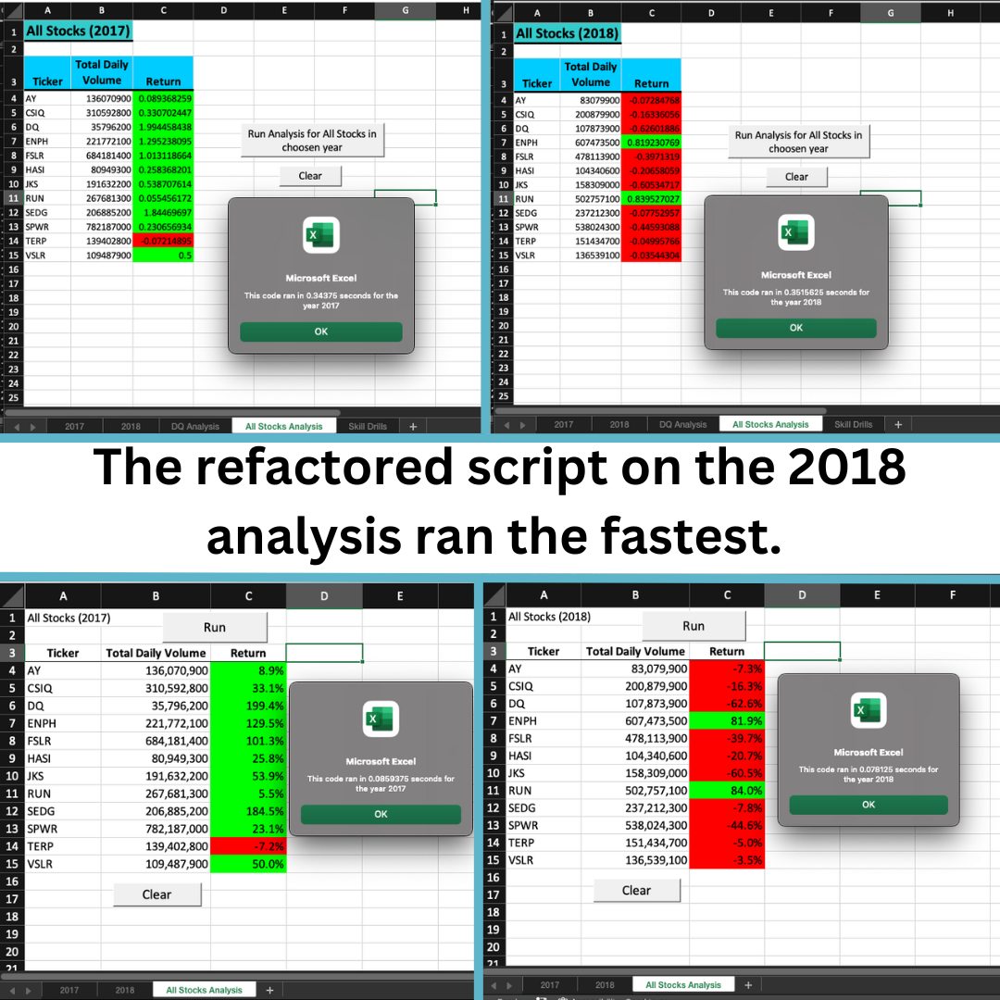
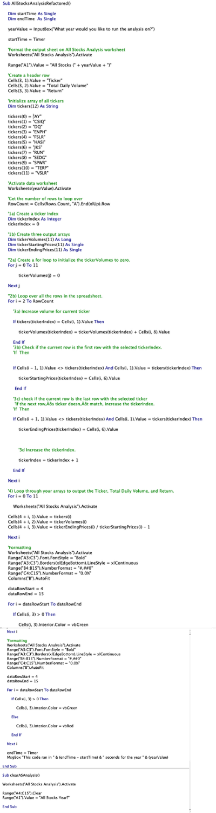

# READ ME
# An Analysis on Stocks

Description: In this analysis we are looking at several green energy stocks. We will analyze the data we have from 2017 and 2018 in order to determine if it's a good idea to invest in any of them.   

## Results
- [Green Stocks Spreadsheet](green_stocks.xlsm)
- [VBA Challenge Spreadsheet](VBA_Challenge.xlsm)

As the images below show 2017 was a better year for all the stocks in our analysis. The stocks ENPH and RUN had positive returns in both 2017 and 2018 making them good future investments. 

The run time of the refactored code on the VBA Challenge Spreadsheet with the 2018 analysis ran the fastest out of them all. Please see image below and refer to the others in the git hub to see close ups of the pics. 

## Images
- The timed results of all code runs on both years in both spreadsheets 

- Code from VBA Challenge Spreadsheet

## Summary

There are many advantages to refactoring code. The most obvious being that time can be saved in running the code the shorter it is. If one is planning on executing a very large data set, then this is very important. It also helps the coder learn and level up their skills when they find shorter and better ways to execute a long swath of code. Some disadvantages are that it can take additional time for the coder to refract the code, but as mentioned, this can pay off for the coder in the long run. 

These pros and cons apply to refactoring the original VBA script in a big way. The time for the code to run now takes a fraction of its original run time and I learned a lot in the end. 
